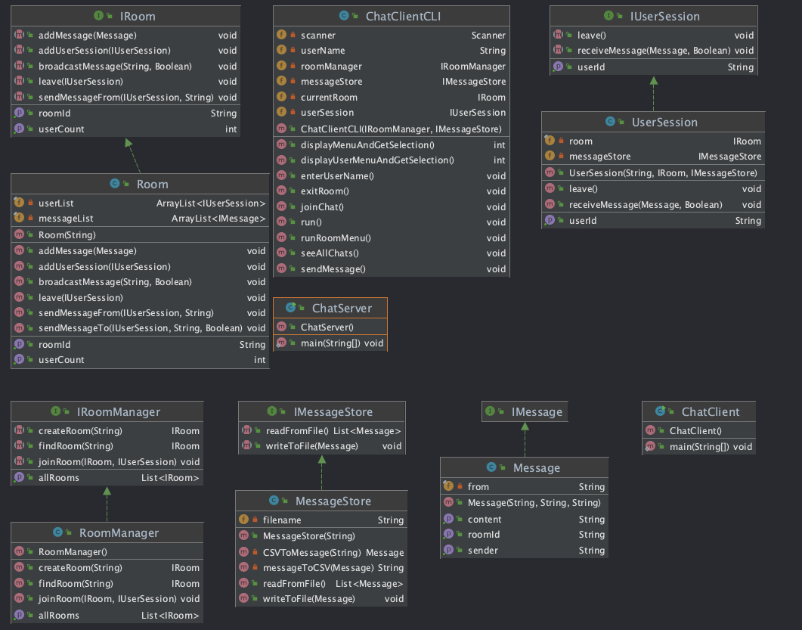
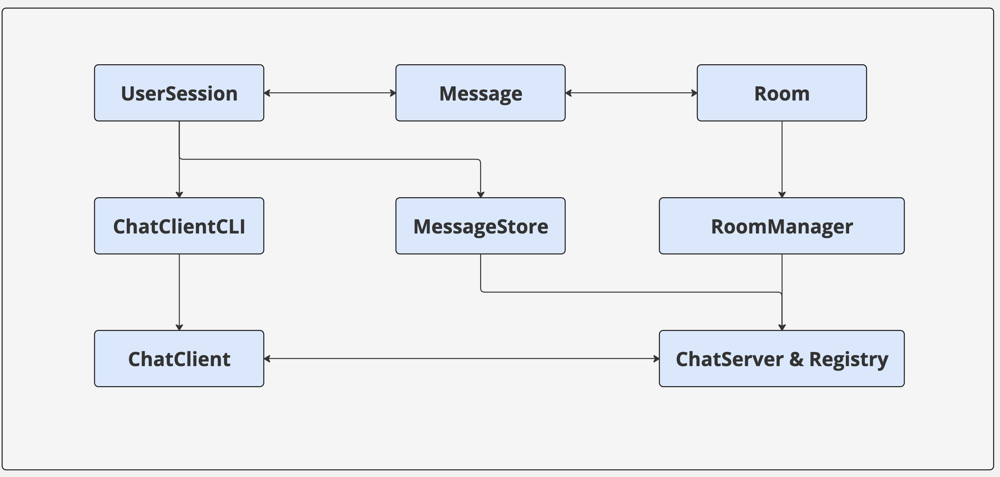

./run.sh

//launch rmiregistry on mandelbrot on port 6090
rmiregistry 6090 &

//launch the server
java -Djava.rmi.server.hostname=localhost  -cp classes src.ChatServer 6090

//launch the client
java -cp classes/ src.ChatClient localhost 6090

